## 1. Purpose

This SOP provides instructions for setting up RStudio, connecting it to GitHub, and managing collaborative research projects using version control. R, RStudio, and GitHub together enable collaborative, transparent, reproducible, and accessible data analysis.


## 2. Scope

- **Applies to:** All EA Program researchers using R for data analysis and collaborative projects
- **Does not apply to:** Local-only R scripts with no version control; Python or other language workflows
- **Location:** RStudio Server at Pomona College; local installations


## 3. Acknowledgements

Substantial contributions: Aparna Chintapalli and Isaac Medina. We acknowledge all students who have followed these instructions and suggested improvements.


## 4. Definitions

**R:** A free, open-source programming environment for statistical computing, maintained by a global community of statisticians and programmers.

**RStudio:** A user interface for R that provides tools to write code, view results, manage files, and integrate with version control. Available as a desktop application or via the Pomona College server.

**GitHub:** A web-based hosting service for Git repositories that enables collaborative code and document management.

**Repository (repo):** A GitHub project folder that contains all files, history, and collaboration settings.

**Version Control:** A system that tracks changes to files over time, allowing multiple people to collaborate while maintaining a complete history of who changed what and when.

**SSH Key:** A cryptographic key pair used to establish a secure connection between RStudio and GitHub without entering a password each time.

**Clone:** Creating a local copy of a GitHub repository on your computer or server.

**Branch:** A parallel line of development that lets you work on a feature or fix without affecting the main codebase until you are ready to merge.

**Pull:** Downloading the latest changes from GitHub to your local copy.

**Commit:** Saving a snapshot of your changes with a descriptive message.

**Push:** Uploading your committed changes to GitHub so collaborators can access them.

**Pull Request (PR):** A GitHub feature that lets you propose merging changes from one branch into another. Collaborators can review the changes before they are merged.

**Merge Conflict:** Occurs when two people edit the same section of a file and Git cannot automatically reconcile the differences.


## 5. Why R + RStudio + GitHub?

| Principle | What It Means |
|:----------|:--------------|
| **Collaboration** | Track who contributed what; manage team edits with version control |
| **Transparency** | Others can see exactly how you analyzed data |
| **Reproducibility** | Re-run any analysis and get the same results |
| **Accessibility** | Access your work from any computer via the web server |

::: {.callout-note}
### Learning Curve
Becoming comfortable with these tools takes time. Some people experience weeks of mistakes before feeling confident; others pick it up quickly. The time you invest directly improves your experience. When you hit a wall, take a break; you will often find a solution after stepping away.
:::


## 6. Interferences

- R updates approximately every six months. New versions occasionally break older code, but this almost never affects new users.
- RStudio Server requires a network connection. If the network is down, the server is inaccessible.
- Large binary files (`.RData`, `.rds`, PDFs, images) slow down Git operations. Keep repositories lean by using `.gitignore` to exclude generated files (see Section 14.4).


## 7. Health and Safety

- Maintain good posture and a well-designed workstation to prevent repetitive strain injuries.
- Take regular breaks to reduce eye strain and frustration.


## 8. Required Materials

| Item | Notes |
|:-----|:------|
| Computer | Laptop or desktop with a web browser |
| Pomona College login | SSO credentials (non-Pomona students: obtain from Cowart ITS help desk each semester) |
| GitHub account | Free at [github.com](https://github.com) |
| Patience | Seriously |


## 9. Estimated Time

| Task | Time |
|:-----|:-----|
| Initial setup (account, SSH key, first clone) | 45 minutes |
| Daily workflow (pull, edit, commit, push) | 2--5 minutes overhead |


## 10. Part 1: Accessing RStudio Server

### 10.1 Login

Open a web browser and go to:

**[rstudio.pomona.edu](https://rstudio.pomona.edu)**

Log in with your Pomona College username and password.

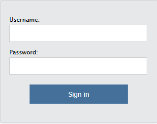{width=50% fig-align="center"}

### 10.2 The Four RStudio Panels

When RStudio opens, you see up to four panels. To see all four, create a file: File > New File > R Script, then save it.

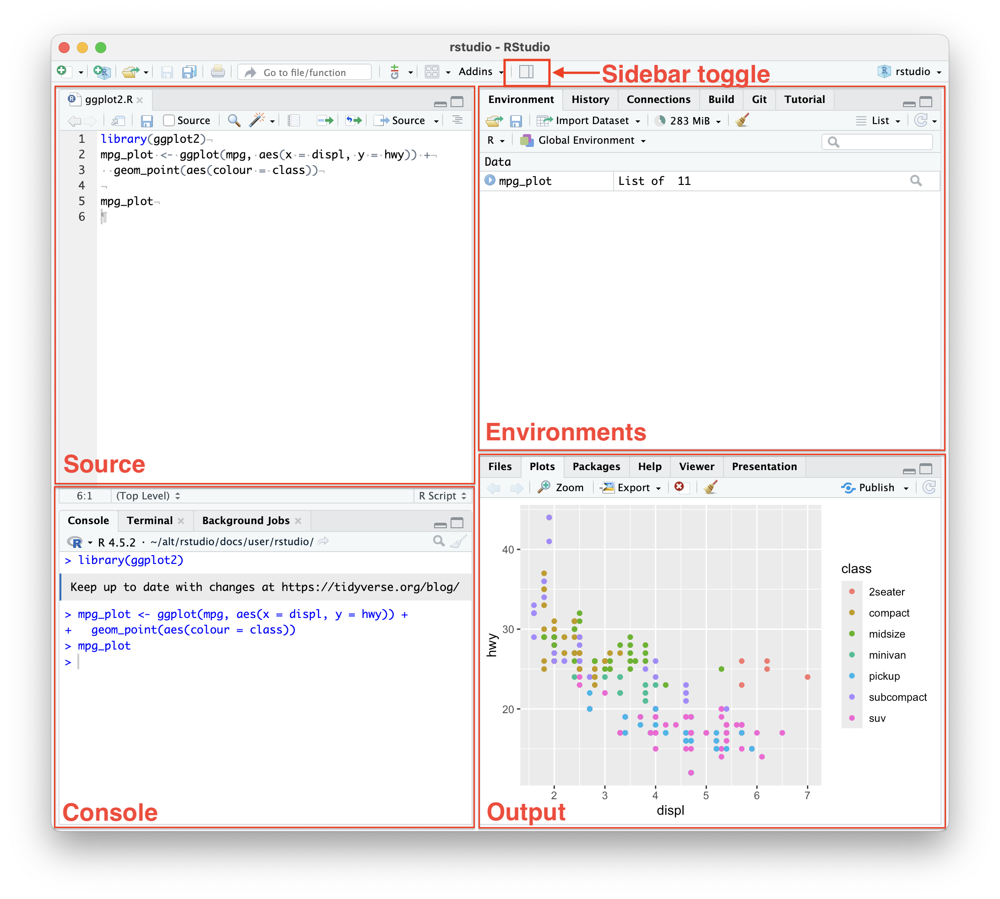{width=90% fig-align="center"}

| Panel | Location | What It Does |
|:------|:---------|:-------------|
| **Source Editor** | Upper left | Edit code and text files (`.R`, `.Rmd`, `.Rnw`, `.qmd`) |
| **Console** | Lower left | Run R commands; view output and errors (in red) |
| **Environment / History / Git** | Upper right | View loaded data objects, command history, and Git status |
| **Files / Plots / Packages / Help** | Lower right | Browse files, view plots, manage packages, read help docs |

### 10.3 Configure knitr

Before your first project, change one setting:

1. Tools > Global Options > Sweave
2. Change "Weave Rnw files" from Sweave to **knitr**
3. Click Apply, then OK


## 11. Part 2: Setting Up GitHub

### 11.1 Create a GitHub Account

1. Go to [github.com](https://github.com) and create a free account
2. Use your Claremont email address (this qualifies you for free private repositories via [education.github.com](https://education.github.com/discount_requests/new))

### 11.2 Create an SSH Key in RStudio

This creates a secure connection so RStudio and GitHub can communicate.

1. In RStudio: Tools > Global Options > Git/SVN
2. Click **Create SSH Key**
3. Select **RSA** under SSH Key Type
4. Leave the passphrase blank (add one later for sensitive projects)
5. Click **Create** (close the pop-up image that appears)
6. Click **View public key**
7. Copy the entire key text (Ctrl-A, then Ctrl-C)

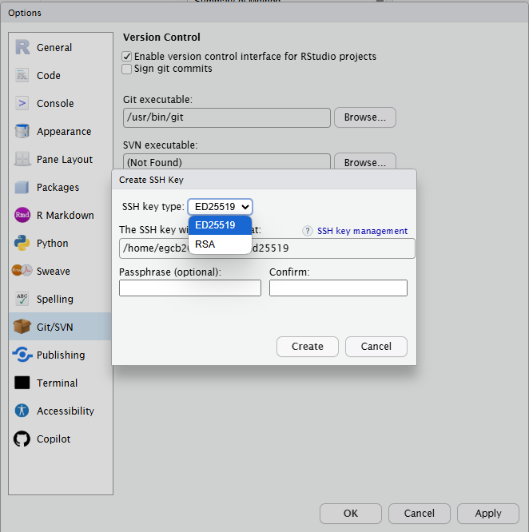{width=50% fig-align="center"}

### 11.3 Add the SSH Key to GitHub

1. On GitHub, click your profile icon (upper right) > **Settings**
2. In the left menu, click **SSH and GPG keys**
3. Click **New SSH key**
4. Title: type something like "RStudio Server"
5. Key: paste the key you copied (Ctrl-V)
6. Click **Add SSH key**

RStudio and GitHub can now communicate securely.

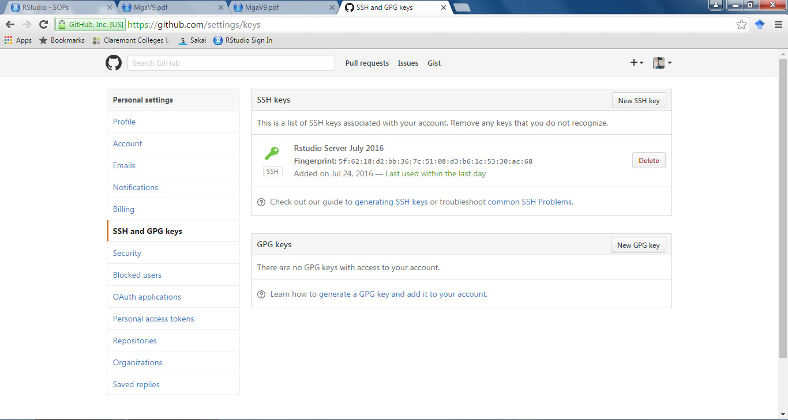{width=60% fig-align="center"}


## 12. Part 3: Cloning Your First Repository

### 12.1 Find the Repository on GitHub

We will practice with a repository called `beginnersluck`. Search GitHub for it under the username `marclos`. Click on the repository to open it.

### 12.2 Copy the SSH Clone URL

1. Click the green **Code** button

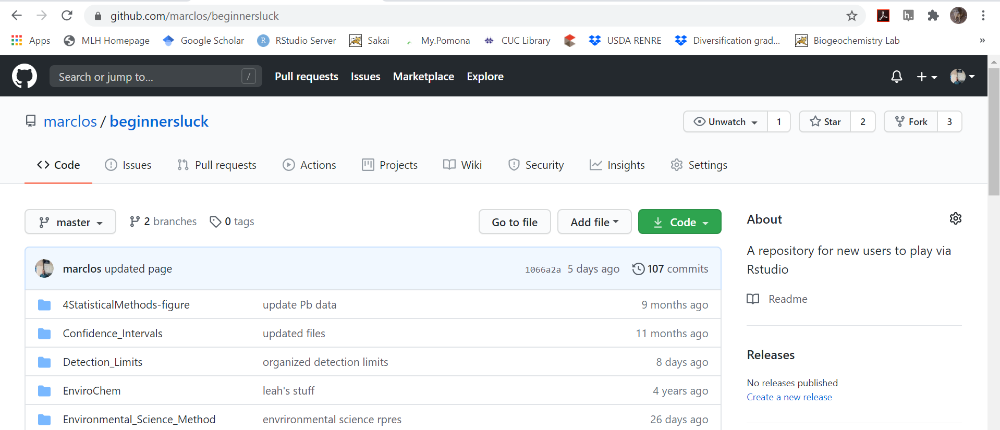{width=60% fig-align="center"}

2. Make sure the tab says **SSH** (not HTTPS). If it says HTTPS, click the **SSH** tab to switch.

::: {.callout-warning}
### Use SSH, Not HTTPS
If you clone with HTTPS instead of SSH, pushing will fail and the project is difficult to fix afterward. Always verify you see `git@github.com:...` in the URL, not `https://github.com/...`.
:::

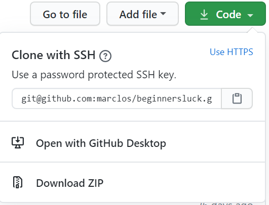{width=60% fig-align="center"}

3. Click the clipboard icon to copy the URL

### 12.3 Create the RStudio Project

1. In RStudio: File > **New Project**
2. Select **Version Control**

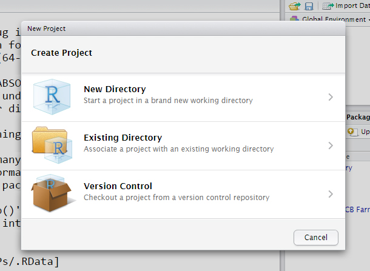{width=60% fig-align="center"}

3. Select **Git**

4. Paste the SSH URL into **Repository URL** (Ctrl-V). The project directory name should auto-fill.
5. Click **Create Project**

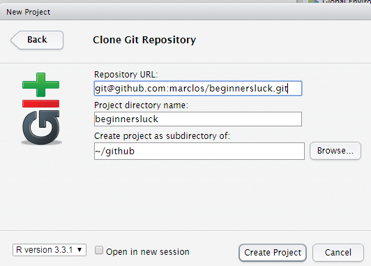{width=70% fig-align="center"}

6. If prompted about "establishing authenticity," type `yes` and click OK

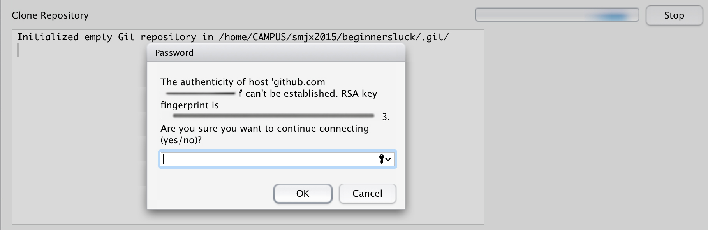{width=70% fig-align="center"}

You should now see the repository files in RStudio's Files panel (lower right).


## 13. Part 4: The Daily Workflow

This is the routine you follow every time you work on a project.

### Step 1: Pull

Before editing anything, pull the latest changes from GitHub. Click the blue **downward arrow** labeled "Pull" in the Git tab (upper right panel).

| Result | Meaning |
|:-------|:--------|
| "Already up-to-date." | No new changes on GitHub since your last pull |
| Summary of file changes | Successful update; your files are now current |
| Error message | Conflict exists; see Troubleshooting (Section 16) |

### Step 2: Edit

Make your changes to files as needed. Save your work.

### Step 3: Commit

1. In the Git tab, check the boxes next to the files you changed (these are "staged" files)

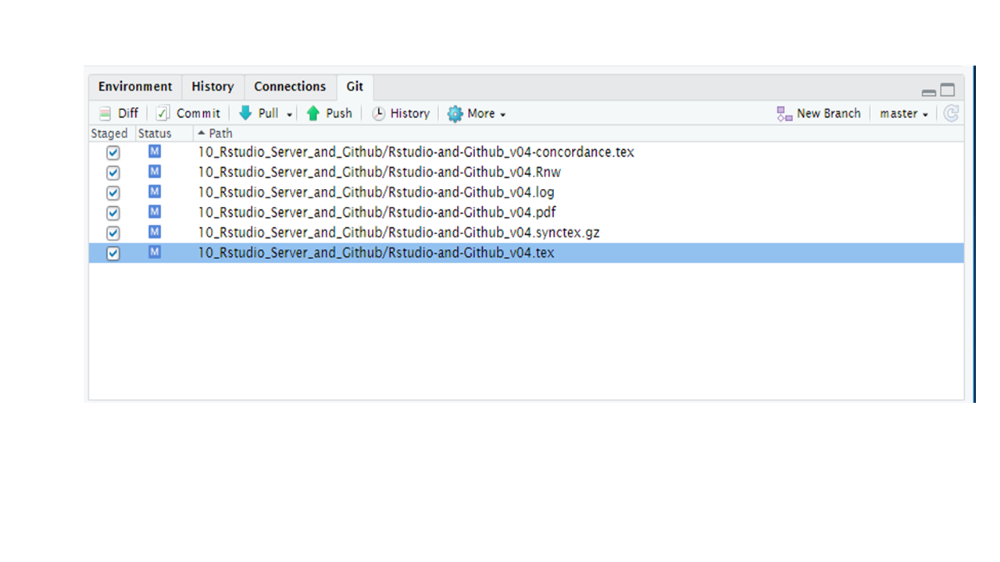{width=75% fig-align="center"}

2. Click **Commit**
3. Write a short, meaningful commit message (see Section 14.5 for conventions)
4. Click **Commit**

### Step 4: Push

Click the green **upward arrow** labeled "Push" in the Git tab.

| Result | Meaning |
|:-------|:--------|
| "Everything up-to-date" | Nothing new to push |
| `e2efe6f..0b18250 master -> master` | Successful push |
| Error message | Conflict or authentication issue; see Troubleshooting (Section 16) |

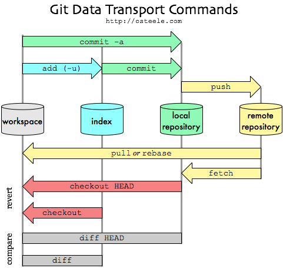{width=90% fig-align="center"}

::: {.callout-tip}
### Remember the Rhythm
**Pull, Edit, Commit, Push.** Every session. If you skip the Pull step, you will eventually create merge conflicts.
:::


## 14. Part 5: Collaboration and Best Practices

### 14.1 Being Added as a Collaborator

To push changes to someone else's repository, the owner must add you as a collaborator. Send them your GitHub username.

### 14.2 Adding Collaborators to Your Repository

1. Go to your repository on GitHub
2. Click **Settings** > **Collaborators**
3. Add collaborators by their GitHub username

### 14.3 Creating a New Repository

1. On GitHub, click the green **New** button (or the "+" icon, then "New repository")
2. Enter a repository name (use lowercase with hyphens, e.g., `soil-carbon-2025`)
3. Choose Public or Private
4. Check **Add a README file** (always recommended)
5. Under "Add .gitignore," select **R**
6. Choose a license (GNU General Public License is a common choice for academic work)
7. Click **Create repository**
8. Clone the new repository into RStudio following Section 12

### 14.4 The .gitignore File

The `.gitignore` file tells Git which files to exclude from version control. When you select the R template during repository creation, GitHub automatically creates a `.gitignore` that excludes common R temporary files. You should also add project-specific exclusions.

Files to exclude from EA Program repositories:

```
# R temporary files (included in R template)
.Rhistory
.RData
.Rproj.user

# Large generated files
*.pdf
*.docx
*.pptx

# Data files too large for GitHub (>50 MB)
*.csv
*.xlsx
data/raw/

# OS files
.DS_Store
Thumbs.db
```

::: {.callout-tip}
### When to Track Data Files
Small data files (under 10 MB) that are essential to reproducing the analysis can be tracked in Git. Large datasets should be stored on the lab shared drive or a data repository (e.g., Dryad, Zenodo) and referenced in the README.
:::

### 14.5 Commit Message Conventions

Good commit messages make it possible to understand the project history at a glance. Follow these conventions:

- Start with a short summary (50 characters or fewer)
- Use the imperative mood ("Add pH results" not "Added pH results")
- Reference the SOP or analysis step if relevant

Examples of good commit messages:

```
Add pH results for site 3
Fix column name typo in soil_data.csv
Update linear model to include interaction term
Clean up figure labels for manuscript draft
```

Examples of unhelpful commit messages:

```
update
fixed stuff
asdf
changes
```


## 15. Part 6: Branching Workflows

Branches let you work on a new feature, analysis, or fix without affecting the main codebase. When the work is complete and reviewed, you merge it back into `main` (or `master`). This is especially useful when multiple people are working in the same repository.

### 15.1 When to Use Branches

For EA Program projects, use branches when:

- You are developing a new analysis that is not yet ready to share
- You are making a large change that might break something
- Multiple people are working on different parts of the same project simultaneously
- You want a collaborator to review your work before it is merged (via a Pull Request)

For small projects with one or two people, working directly on `main` with the daily Pull-Edit-Commit-Push workflow (Section 13) is fine.

### 15.2 Branch Naming Conventions

Use a prefix system to communicate the branch's purpose at a glance:

| Prefix | Purpose | Example |
|:-------|:--------|:--------|
| `feature/` | Adding new capabilities, analyses, or tools | `feature/linear-regression-model` |
| `fix/` | Fixing errors, broken code, or broken links | `fix/data-import-error` |
| `docs/` | Writing or updating documentation | `docs/update-methods-section` |
| `data/` | Updating or cleaning data assets | `data/add-2025-field-season` |

Keep branch names short, lowercase, and hyphenated. Each branch should focus on one task.

### 15.3 Creating a Branch in RStudio

1. Open the **Git** tab in the upper-right panel
2. Click the **New Branch** button (the purple icon with two connected squares in the Git toolbar)
3. Type a descriptive name (e.g., `feature/add-soil-ph-analysis`)
4. Ensure **Sync branch with remote** is checked (this links your local branch to GitHub)
5. Click **Create**

RStudio automatically switches you to the new branch. You can confirm which branch you are on by looking at the branch name displayed in the Git tab.

### 15.4 Working on a Branch

The daily workflow is the same as Section 13 (Pull, Edit, Commit, Push), except your changes only affect the branch you are on. Other collaborators working on `main` will not see your changes until you merge.

### 15.5 Merging via Pull Request (Recommended)

When your branch work is complete:

1. Push all commits to GitHub
2. On GitHub, navigate to your repository. GitHub will usually show a banner saying "Compare & pull request" for your recently pushed branch. Click it.
3. Write a title and description explaining what the branch accomplishes
4. Assign a reviewer (your PI or a collaborator)
5. Click **Create pull request**
6. The reviewer examines the changes. Once approved, click **Merge pull request** on GitHub.
7. After merging, delete the branch on GitHub (GitHub offers a button for this)
8. Back in RStudio, switch to `main` and pull to get the merged changes:

```bash
git checkout main
git pull
```

### 15.6 Merging Locally (Simple Projects)

For small projects where a Pull Request review is not needed:

```bash
git checkout main
git pull
git merge feature/your-branch-name
git push
```

If there are no conflicts, the merge completes automatically. If conflicts arise, see Section 16.2.

### 15.7 Deleting a Branch After Merging

After a branch has been merged, delete it to keep the repository clean:

```bash
# Delete the local branch
git branch -d feature/your-branch-name

# Delete the remote branch
git push origin --delete feature/your-branch-name
```

In RStudio, you may need to restart the R session or close and reopen the project to refresh the branch list in the Git tab.


## 16. Troubleshooting

### 16.1 Identity Error

**You see:** An error about missing user identity.

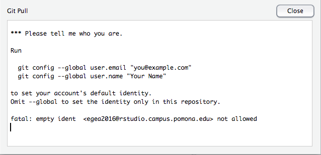{width=60% fig-align="center"}

**Fix:** In the Git tab, click the gear icon > Shell, then type:

```bash
git config user.email "your.email@claremont.edu"
git config user.name "Your Name"
```

### 16.2 Merge Conflicts

**You see:** Files with a "U" (unmerged) status in the Git tab, and markers like `<<<<<<< HEAD` inside the file.

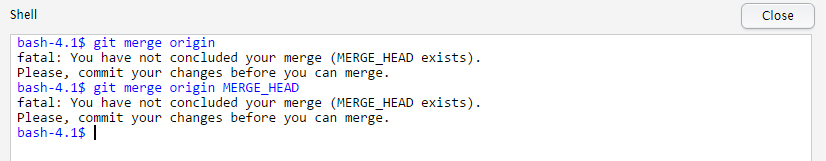{width=70% fig-align="center"}

**Fix:**

1. Open the conflicted file
2. Find the conflict markers:

```text
<<<<<<< HEAD
Your current version of the code.
=======
The incoming version from the other branch.
>>>>>>> branch-name
```

3. Edit the file to keep the correct content. Delete all three marker lines (`<<<<<<<`, `=======`, `>>>>>>>`).
4. Save the file
5. Stage it (check the box in the Git tab)
6. Commit with a message like "Resolve merge conflict in analysis.R"
7. Push

::: {.callout-note}
### Binary File Conflicts
If the conflict involves a binary file (`.RData`, `.rds`, saved plot images), GitHub's web editor cannot open it. You must resolve it locally by choosing which version to keep. In the Git shell:

```bash
# Keep your version
git checkout --ours path/to/file.RData

# Or keep the incoming version
git checkout --theirs path/to/file.RData
```

Then stage, commit, and push.
:::

### 16.3 "fatal: Not possible to fast-forward, aborting."

**Fix:** In the Git shell:

```bash
git pull --rebase
```

### 16.4 Pull Rejected (Unmerged Files)

**You see:** "Pull is not possible because you have unmerged files."

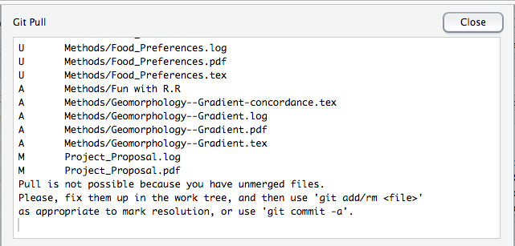{width=70% fig-align="center"}

**Fix:** Resolve the merge conflicts first (Section 16.2), commit, then pull again.

### 16.5 Divergent Branches

**You see:** "You have divergent branches and need to specify how to reconcile them."

**Fix:** In the Git shell:

```bash
git config pull.rebase false
git pull
```

If this happens frequently, set the preference globally so you do not have to repeat it:

```bash
git config --global pull.rebase false
```

### 16.6 Non-Fast-Forward Errors

**You see:** Push is rejected because someone else pushed to the same branch.

**Fix:**

```bash
git pull
```

This fetches and merges the remote changes. Resolve any conflicts (Section 16.2), then push again.

### 16.7 Push Rejected After Branch Merge

**You see:** Push is rejected on a branch that was already merged and deleted on GitHub.

**Fix:** Switch to `main`, pull, and delete the stale local branch:

```bash
git checkout main
git pull
git branch -d feature/old-branch-name
```

### 16.8 Last Resort: Delete and Re-Clone

If nothing else works and you are willing to lose your uncommitted local changes (or have saved them elsewhere):

1. In RStudio: Session > Terminate R
2. Delete the project folder from the Files panel
3. Re-clone the repository from scratch (Section 12)

::: {.callout-warning}
This discards all local changes that were not pushed to GitHub. Make sure you have saved any important work before doing this.
:::


## 17. Part 7: Creating and Rendering Rmd/Qmd Files

### 17.1 What Are Rmd and Qmd Files?

R Markdown (`.Rmd`) and Quarto (`.qmd`) files combine narrative text with executable R code in a single document. When you "knit" (Rmd) or "render" (Qmd) the file, R runs all the code chunks and produces a formatted output document (HTML, PDF, or Word).

This is the foundation of reproducible research in the EA Program: your methods, code, results, and interpretation all live in one file that anyone can re-run.

### 17.2 Creating a New File

1. File > New File > **R Markdown** (for `.Rmd`) or **Quarto Document** (for `.qmd`)
2. Enter a title and author
3. Choose an output format (HTML is the easiest to start with)
4. Click **Create**

### 17.3 File Structure

Both formats use the same basic structure:

```markdown
---
title: "My Analysis"
author: "Your Name"
date: today
format: html
---

## Introduction

Narrative text goes here. You can use **bold**, *italic*,
and [links](https://example.com).

## Methods

Here is an R code chunk:

```{r}
#| label: load-data
#| eval: false
#| echo: true
data <- read.csv("my_data.csv")
summary(data)
```

The code above loads the data and prints a summary.

## Results

```{r}
#| label: plot-results
#| eval: false
#| echo: true
#| fig-cap: "Soil pH by site"
plot(data$site, data$pH)
```

The YAML header (between `---` lines) controls the document metadata and output format. Code chunks (between `` ```{r} `` and `` ``` ``) contain R code that is executed when the document is rendered.

### 17.4 Rendering

- **Rmd files:** Click the **Knit** button (or Ctrl+Shift+K)
- **Qmd files:** Click the **Render** button (or Ctrl+Shift+K)

The output appears in the Viewer panel or opens in a new window.

### 17.5 Rmd vs. Qmd

| Feature | Rmd | Qmd |
|:--------|:----|:----|
| Maintained by | RStudio/Posit | Quarto project (open source) |
| Requires R | Yes | No (also supports Python, Julia) |
| Chunk options | In the chunk header: `{r, echo=TRUE}` | On separate lines: `#| echo: true` |
| Multi-format output | Yes | Yes, with more options |
| SOP system uses | Qmd (preferred for new documents) |  |

For new EA Program documents, use `.qmd`. Existing `.Rmd` files will continue to work.

::: {.callout-tip}
### Common Chunk Options

- `#| echo: true` shows the code in the output (use for teaching)
- `#| echo: false` hides the code (use for reports)
- `#| eval: false` shows the code but does not run it
- `#| fig-cap: "Caption text"` adds a figure caption
- `#| warning: false` suppresses warning messages
:::


## 18. Recommended Resources

- [RStudio YouTube Introduction](https://www.youtube.com/watch?v=uHYcDQDbMY8)
- [GitHub YouTube Introduction](https://www.youtube.com/watch?v=0fKg7e37bQE)
- [GitHub for Beginners](http://product.hubspot.com/blog/git-and-github-tutorial-for-beginners)
- [Understanding the GitHub Flow](https://guides.github.com/introduction/flow/)
- [Happy Git and GitHub for the useR](https://happygitwithr.com/) (comprehensive guide by Jenny Bryan)
- [Quarto Documentation](https://quarto.org/docs/get-started/)


## 19. Advanced Topics

### 19.1 Installing R and RStudio Locally

Start with the server. When ready for a local installation, install in this order:

1. R: [cran.r-project.org](https://cran.r-project.org/)
2. RStudio Desktop: [posit.co/download/rstudio-desktop](https://posit.co/download/rstudio-desktop/)
3. Git: [git-scm.com](https://git-scm.com/) (needed for version control on local installs)

### 19.2 GitHub Issues for Task Tracking

GitHub Issues can be used as a lightweight task tracker for research projects. Create an issue for each task ("Run soil texture analysis for sites 4--6"), assign it to a team member, and close it when the work is merged. This creates a record of who did what and when.

### 19.3 Protecting the Main Branch

For repositories with multiple active contributors, the repository owner can enable branch protection rules on GitHub:

1. Go to Settings > Branches > Add rule
2. Enter `main` as the branch name pattern
3. Check **Require a pull request before merging**
4. Optionally check **Require approvals** (set to 1)

This prevents anyone from pushing directly to `main` and ensures all changes go through a Pull Request review.


## 20. References

- R Core Team. *R: A Language and Environment for Statistical Computing*. Available at: <https://www.r-project.org/>
- Posit. *RStudio IDE*. Available at: <https://posit.co/products/open-source/rstudio/>
- GitHub. *GitHub Docs*. Available at: <https://docs.github.com/>
- Bryan, J. *Happy Git and GitHub for the useR*. Available at: <https://happygitwithr.com/>


## 21. Training Record

Before using R/RStudio/GitHub independently for EA Program research, personnel must:

1. Read this SOP in full
2. Create a GitHub account and configure SSH keys (Sections 11.1--11.3)
3. Successfully clone, pull, edit, commit, and push to the `beginnersluck` practice repository (Sections 12--13)
4. Create and render at least one `.qmd` file (Section 17)
5. Demonstrate the Pull-Edit-Commit-Push workflow under supervision
6. Be signed off by the PI or project lead
